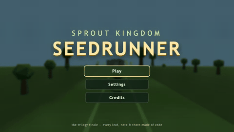
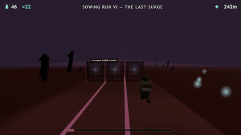
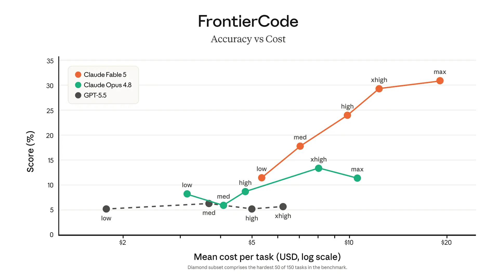

# Fable Games Test

[](LICENSE)
[](https://jason-c-dev.github.io/fable-games-test/)
[](https://www.anthropic.com/claude/fable)
[](https://pixijs.com)
[](https://threejs.org)
[](https://tonejs.github.io)
[](#qa)
[](#fable-games-test)

Three complete browser games — a trilogy, three generations apart, built
entirely by Claude from three prompts: a 16-bit platformer, an HD
action-platformer, and a 3D lane-runner finale. No external assets anywhere —
every sprite, polygon, sound and song in all three games is generated in code.

| | Play | Source | Prompt |
|---|---|---|---|
| 🌱 **Sprout Kingdom** | [play it](https://jason-c-dev.github.io/fable-games-test/sprout-kingdom/) | [`sprout-kingdom/`](sprout-kingdom/) | [`platformer-prompt.md`](sprout-kingdom/platformer-prompt.md) |
| 🗡️ **Sprout Kingdom: Overgrown** | [play it](https://jason-c-dev.github.io/fable-games-test/overgrown/) | [`overgrown/`](overgrown/) | [`platformer2-prompt.md`](overgrown/platformer2-prompt.md) |
| 🌰 **Sprout Kingdom: Seedrunner** | [play it](https://jason-c-dev.github.io/fable-games-test/seedrunner/) | [`seedrunner/`](seedrunner/) | [`runner3-prompt.md`](seedrunner/runner3-prompt.md) · [build plan](seedrunner/PLAN.md) |

---

## 🌱 Sprout Kingdom (the original)

<p>
<a href="https://jason-c-dev.github.io/fable-games-test/sprout-kingdom/"></a>
<a href="https://jason-c-dev.github.io/fable-games-test/sprout-kingdom/"></a>
<br><sup>▶ click either to play</sup>
</p>

A complete 16-bit-style platformer in the classic mold: pure vanilla
JavaScript on a Canvas 2D context, zero dependencies, pixel art drawn
tile-by-tile in code, chiptune-flavoured WebAudio sound.

Pip the sprout crosses four worlds — Meadow, Cavern, Cloudline, and Bramble
Keep — to recover the six Sun Seeds from General Bramble. Momentum movement,
stomps, shell-carrying and chain combos, power tiers (Sprout → Blossom →
Glider Cap), spin-hops, secret exits, bonus cellars, three hidden Dew Stars
per level, and four multi-phase bosses.

**Controls:** arrows/WASD move, Z/Space jump, X run/carry, Down enters
burrow doors. Enter to start.

## 🗡️ Sprout Kingdom: Overgrown (the sequel)

<p>
<a href="https://jason-c-dev.github.io/fable-games-test/overgrown/"></a>
<a href="https://jason-c-dev.github.io/fable-games-test/overgrown/"></a>
<br><sup>▶ click either to play</sup>
</p>

The same kingdom years later, remade as a modern HD action-platformer:
PixiJS v8 (WebGL) rendering of smooth vector-style art with dynamic 2D
lighting and a per-world color-grade/vignette post pass, a skeletal-animation
rig for Pip, GPU-friendly pooled particles, and a fully synthesized adaptive
soundtrack in Tone.js — base layers plus percussion and counter-melody that
crossfade in on the bar as danger rises.

Combat is the headline: the Thorn Blade (3-hit combos, charge spin-slash),
an 8-frame parry that freezes time and reflects projectiles, a down-plunge
pogo, the Sunbeam Lance with mirror-routing light puzzles, and a Sap Gauge
spent on healing or a screen-clearing bloom burst. Movement grows dash,
wall-jump, ledge-grab, swimming and gliding. Dew Stars are currency now,
spent at upgrade shrines without losing the collection record. Four bosses
each built around parry/pogo/dash-through — ending in a duel with General
Bramble where parry timing is the only way through.

**Controls:** arrows/WASD move, Space jump, X sword, C dash, V parry,
F beam, Q heal (Up+Q burst), Esc pause, F3 debug. Gamepad supported, keys
remappable in Settings.

## 🌰 Sprout Kingdom: Seedrunner (the finale)

<p>
<a href="https://jason-c-dev.github.io/fable-games-test/seedrunner/"></a>
<a href="https://jason-c-dev.github.io/fable-games-test/seedrunner/"></a>
<br><sup>▶ click either to play</sup>
</p>

The trilogy closer jumps to 3D: a Three.js lane-runner where Pip re-sows the
six Sun Seeds down the old Seedways with the **Rot Tide** — a crawling wall
of dark growth whose distance *is* the health bar — always surging behind.
Low-poly procedural everything: the track bends along an analytic spline,
obstacles and scenery are instanced primitives, Pip is a rigged primitive
figure with squash-and-stretch and a fluttering leaf cape, and the four
biomes are fog-graded palettes (Cavern darkness with lantern pools, Cloudline
wind that bends your jumps mid-air, Bramble Wastes rot-barrier gauntlets).

The signature move returns one last time as the **bloom parry**: rot barriers
telegraph with a glint and a chime, and a well-timed press shatters them,
slows time, banks dew, and shoves the Tide back. Six campaign Sowing Runs
(fixed-seed, hand-authored from verified track chunks) build to a scripted
finale chase with the whole trilogy cast cheering the final stretch, a
closing cutscene and credits; an endless mode composes the same verified
chunks procedurally with a daily seed. The music is four-layer adaptive
Tone.js — percussion and counter-melody follow your pace, and a dedicated
panic layer rides the Tide's proximity.

**Controls:** ←/→ or A/D switch lanes, Space jump (hold for height), ↓/S
slide, Shift/C dash, X/K bloom parry, Esc pause, F3 perf overlay. Gamepad
supported, keys remappable in Settings.

## How they differ

| | Sprout Kingdom | Overgrown | Seedrunner |
|---|---|---|---|
| Rendering | Canvas 2D, 16-bit pixel art | PixiJS v8 WebGL, HD vector-style, lighting + post FX | Three.js WebGL, low-poly 3D, fog-graded biomes, fake-bloom glows |
| Animation | Frame-flip sprites | Skeletal rigs, squash & stretch, procedural secondary motion | Procedural rig poses per sim state, cape/cap secondary motion |
| Audio | WebAudio chiptune | Tone.js adaptive layered themes, beat-quantized stingers | + a panic layer wired to the Rot Tide's distance |
| Movement | Run, jump, spin-hop, glide | + dash, wall-jump, ledge-grab, down-plunge pogo, swim | Auto-run: lane switch, hold-jump, slide-cancel, i-frame dash |
| Combat | Stomps and shells | Sword combos, parry, ranged beam, specials | One verb, perfected: the bloom parry |
| Health | Power-size tiers | Hearts + Sap Gauge | The Tide's distance is the health bar |
| Progression | Score, lives, secret exits | + upgrade shrines, best times, relics | Six Sowing Runs, checkpoints, endless mode with daily seed |
| Dependencies | None | PixiJS + Tone.js, vendored (no CDN, no build) | Three.js + Tone.js, vendored (no CDN, no build) |
| Sim/QA | Reachability verifier + browser tests | + 86 headless probes that drive the real simulation | + a reaction-limited bot that must no-hit every chunk at every speed |
| Code | ~6.2k lines | ~10.2k lines | ~5.4k lines |

All three ship with their own headless QA: verifiers tuned to each game's
movement physics, Playwright browser flows, and focused mechanics tests.
Overgrown added "reality probes" that script the actual player through its
hardest moves; Seedrunner goes one further — its chunk verifier has no
physics model of its own at all, it plays every authored chunk in the real
sim with a bot capped at human reaction speed, entered from every lane at
every speed tier it can appear at (696 playthroughs), so the verifier and
the game cannot drift apart. Every level in all three games is
machine-verified completable.

## The experiment: Fable 5 at `xhigh`

All three games were built by [Claude Fable 5](https://www.anthropic.com/claude/fable)
(`claude-fable-5`) running in Claude Code on an always-on Mac mini, reasoning
effort set to **`xhigh`** (one tier below the maximum; the harness setting —
effort isn't recorded in the logs), working largely autonomously from the
three prompts in this repo. Token figures below are read directly from the
project's session logs (`~/.claude/projects/.../*.jsonl`), which record the
API-metered usage of every turn, each measured at its own publish time.

| Session | Scope | Turns | Fresh input | Cache writes | Cache reads | Output |
|---|---|---:|---:|---:|---:|---:|
| `3380085b` | Sprout Kingdom: build + next-day music/boss/feel pass | 344 | 73,070 | 3,117,632 | 80,482,075 | 1,435,600 |
| `3750ea21` | Overgrown: build + bug-fix rounds + publishing | 777 | 168,106 | 4,597,303 | 408,033,653 | 2,083,309 |
| `9e4e4faf` | Seedrunner: full build, QA suites, publishing | 440 | 65,294 | 1,071,781 | 103,360,010 | 835,109 |
| **Total** | | **1,561** | **306,470** | **8,786,716** | **591,875,738** | **4,354,018** |

(The Overgrown session log later grew past its published row — the same
session went on to write Seedrunner's spec and build plan, ~124 more turns
and ~117k more output. Those planning tokens are honestly part of
Seedrunner's cost story; they're just logged under generation 2's session.)

**Cost, two ways** — API list pricing for Fable 5 is
[$10 / M input and $50 / M output](https://www.anthropic.com/claude/fable),
with prompt caching at the standard 1.25× to write and 0.1× to read:

| | Input | Cache write | Cache read | Output | **Total** |
|---|---:|---:|---:|---:|---:|
| Sprout Kingdom session | $0.73 | $38.97 | $80.48 | $71.78 | **≈ $192** |
| Overgrown session | $1.68 | $57.47 | $408.03 | $104.17 | **≈ $571** |
| Seedrunner session | $0.65 | $13.40 | $103.36 | $41.76 | **≈ $159** |
| **All three, API-equivalent** | | | | | **≈ $922** |
| Same usage without caching | | | | | ≈ $6,230 |
| Actual cost on a Claude Max 20x subscription | | | | | flat monthly fee |

Notes: output tokens include `xhigh`'s extended thinking, which is a big part
of why the output column is heavy; cache reads dominate raw volume because
long agentic sessions re-read their full context every turn — caching cut the
would-be bill by ~85%. Subscription list prices at time of writing are on
[claude.com/pricing](https://claude.com/pricing) (Pro from $17/mo, Max tiers
from $100/mo). And "flat monthly fee" is not "free": Max plans budget real
capacity — the first two games consumed **38% of the plan's available Fable 5
usage for the current window** (which resets July 7), and Seedrunner's
session added roughly another 835k output tokens — about 40% of what
Overgrown took — on the same window. A complete trilogy for well under one
usage window is the actual subscription-side price.

**Model performance context** (from Anthropic's
[Fable 5 page](https://www.anthropic.com/claude/fable) and the
[Fable 5 / Mythos 5 announcement](https://www.anthropic.com/news/claude-fable-5-mythos-5),
which has the frontier-code accuracy-vs-cost chart): Fable 5 scores highest
among frontier models on Cognition's FrontierCode eval *even at medium
effort*, was first past 90% on Anthropic's core analytics benchmark (a
10-point jump over Opus), and runs long agentic sessions "for days
unattended" — Stripe's testing line was that it "compressed months of
engineering into days." Fable 5 and Mythos 5 share the same underlying model;
Fable is the generally available variant with additional safety measures.

**Why `xhigh`?** (experimenter's note): the FrontierCode accuracy-vs-cost
curve below made `xhigh` look like the knee of the curve — on the hardest-50
"diamond" subset, Fable 5 at `xhigh` scores ≈29% at ≈$13 mean cost per task,
while `max` buys only ≈2 more points for roughly 50% more cost per task.
(For scale: Opus 4.8 *tops out* around 13% at its own `xhigh`, below Fable 5's
`low`.) Honest caveat: plain `high` was never tested for this project and may
well be the better price/performance point overall — it sits at ≈24% for
≈$10/task on the same chart, and FrontierCode-class coding clearly holds up
surprisingly far down the effort ladder.

<p align="center">
<a href="https://www.anthropic.com/news/claude-fable-5-mythos-5"></a>
<br><sup>FrontierCode accuracy vs mean cost per task, across reasoning-effort levels. Source: <a href="https://www.anthropic.com/news/claude-fable-5-mythos-5">Anthropic, Fable 5 / Mythos 5 announcement</a>.</sup>
</p>

**A note on Fable 5's safety controls.** Fable 5 ships with
[additional dual-use safeguards](https://www.anthropic.com/news/redeploying-fable-5)
— layered classifiers with a deliberately large safety margin (Anthropic
accepts more false positives on this model by design), and when a request
trips them it can be **blocked and rerouted to Claude Opus 4.8**. A game
build is full of vocabulary a classifier could misread — "kill the boss,"
weapons, damage, "attack patterns" — so it's fair to ask whether parts of
these games were quietly built by Opus 4.8 instead. What the session logs
can attest: every one of the **1,683 assistant turns across all three
sessions reported `claude-fable-5`** in its response metadata, none reported
`claude-opus-4-8`, and the documented reroute behavior is accompanied by a
user notification — which never appeared. No refusals or blocks were hit in
either session (the classifiers target real-world harm capability, e.g.
offensive cyber, not fantasy combat). The honest limit of that evidence:
response metadata is all any client-side harness can see — neither the
tooling nor the model itself can independently verify which weights actually
served a given token.

One more honest caveat: at the time of writing, **no human has played any of
the three games end-to-end**. Every "verified completable" claim comes from
Fable's own QA — reachability verifiers, 891 automated checks, scripted bot
playthroughs of every boss and every Sowing Run. Early human contact with the
first two games already found and fixed real issues the automation modeled
wrong (a sealed wall-jump shaft, updrafts that couldn't lift, a Retina
rendering bug); Seedrunner tries to close that class of bug by making its
verifier play the real simulation with human-speed reactions, but "the bot
had a fair line through it" still isn't the same claim as "it feels good to
play." The gap between "machine-proven" and "actually fun for hands on keys"
is part of what this experiment measures.

## Running locally

```bash
git clone https://github.com/jason-c-dev/fable-games-test.git
cd fable-games-test
python3 -m http.server 8378
# original: http://localhost:8378/sprout-kingdom/
# sequel:   http://localhost:8378/overgrown/
# finale:   http://localhost:8378/seedrunner/
```

No server handy? `overgrown/standalone.html` and `seedrunner/standalone.html`
are each a whole game in a single file — double-click them. (The modular
`index.html` versions need http(s) because browsers block ES-module loading
over `file://`; rebuild a standalone after code changes with
`node tools/build-standalone.js`, which needs `npm i -g esbuild`.) The
original game is classic scripts and runs from `file://` as-is.

## QA

```bash
cd sprout-kingdom
node tools/verify-levels.js                      # level reachability
NODE_PATH=$(npm root -g) node tools/browser-test.js    # needs the server up

cd ../overgrown
node tools/verify-levels.js    # reachability, all 23 rooms
node tools/sim-probe.js        # 86 headless mechanics + boss probes
node tools/browser-test.js     # 19 Playwright flows (server on :8378)
node tools/mechanics-test.js   # real-keyboard input checks

cd ../seedrunner
node tools/verify-chunks.js    # 696 reaction-limited bot playthroughs: every
                               # chunk × speed tier × entry lane, all 6 runs,
                               # 3 endless seeds — zero problems required
node tools/sim-probe.js        # 38 frame-data probes incl. model-vs-sim honesty
node tools/browser-test.js     # 36 Playwright flows (server on :8378)
node tools/reaction-audit.js   # human-reaction-window distribution per run
```

---

Built by Claude (Fable 5) over three sessions in July 2026, from prompts by
[@jason-c-dev](https://github.com/jason-c-dev). The prompts are in the repo;
everything else grew from them.
