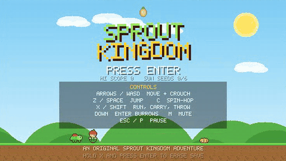
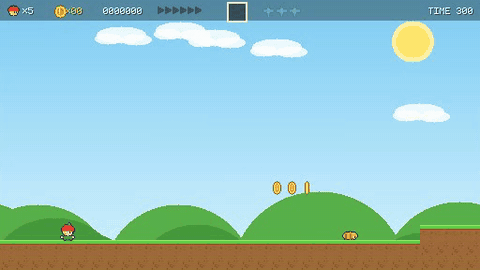
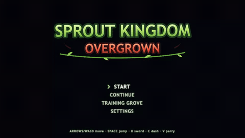
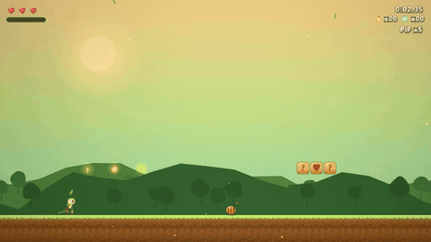

# Fable Games Test

[](LICENSE)
[](https://jason-c-dev.github.io/fable-games-test/)
[](https://www.anthropic.com/claude/fable)
[](https://pixijs.com)
[](https://tonejs.github.io)
[](#qa)
[](#fable-games-test)

Two complete browser platformers, two generations apart, built entirely by
Claude from a pair of prompts. No external assets anywhere — every sprite,
tile, sound and song in both games is generated in code.

| | Play | Source | Prompt |
|---|---|---|---|
| 🌱 **Sprout Kingdom** | [play it](https://jason-c-dev.github.io/fable-games-test/sprout-kingdom/) | [`sprout-kingdom/`](sprout-kingdom/) | [`platformer-prompt.md`](sprout-kingdom/platformer-prompt.md) |
| 🗡️ **Sprout Kingdom: Overgrown** | [play it](https://jason-c-dev.github.io/fable-games-test/overgrown/) | [`overgrown/`](overgrown/) | [`platformer2-prompt.md`](overgrown/platformer2-prompt.md) |

---

## 🌱 Sprout Kingdom (the original)

<p>
<a href="https://jason-c-dev.github.io/fable-games-test/sprout-kingdom/"></a>
<a href="https://jason-c-dev.github.io/fable-games-test/sprout-kingdom/"></a>
<br><sup>▶ click either to play</sup>
</p>

A complete 16-bit-style platformer in the classic mold: pure vanilla
JavaScript on a Canvas 2D context, zero dependencies, pixel art drawn
tile-by-tile in code, chiptune-flavoured WebAudio sound.

Pip the sprout crosses four worlds — Meadow, Cavern, Cloudline, and Bramble
Keep — to recover the six Sun Seeds from General Bramble. Momentum movement,
stomps, shell-carrying and chain combos, power tiers (Sprout → Blossom →
Glider Cap), spin-hops, secret exits, bonus cellars, three hidden Dew Stars
per level, and four multi-phase bosses.

**Controls:** arrows/WASD move, Z/Space jump, X run/carry, Down enters
burrow doors. Enter to start.

## 🗡️ Sprout Kingdom: Overgrown (the sequel)

<p>
<a href="https://jason-c-dev.github.io/fable-games-test/overgrown/"></a>
<a href="https://jason-c-dev.github.io/fable-games-test/overgrown/"></a>
<br><sup>▶ click either to play</sup>
</p>

The same kingdom years later, remade as a modern HD action-platformer:
PixiJS v8 (WebGL) rendering of smooth vector-style art with dynamic 2D
lighting and a per-world color-grade/vignette post pass, a skeletal-animation
rig for Pip, GPU-friendly pooled particles, and a fully synthesized adaptive
soundtrack in Tone.js — base layers plus percussion and counter-melody that
crossfade in on the bar as danger rises.

Combat is the headline: the Thorn Blade (3-hit combos, charge spin-slash),
an 8-frame parry that freezes time and reflects projectiles, a down-plunge
pogo, the Sunbeam Lance with mirror-routing light puzzles, and a Sap Gauge
spent on healing or a screen-clearing bloom burst. Movement grows dash,
wall-jump, ledge-grab, swimming and gliding. Dew Stars are currency now,
spent at upgrade shrines without losing the collection record. Four bosses
each built around parry/pogo/dash-through — ending in a duel with General
Bramble where parry timing is the only way through.

**Controls:** arrows/WASD move, Space jump, X sword, C dash, V parry,
F beam, Q heal (Up+Q burst), Esc pause, F3 debug. Gamepad supported, keys
remappable in Settings.

## How they differ

| | Sprout Kingdom | Overgrown |
|---|---|---|
| Rendering | Canvas 2D, 16-bit pixel art | PixiJS v8 WebGL, HD vector-style, lighting + post FX |
| Animation | Frame-flip sprites | Skeletal rigs, squash & stretch, procedural secondary motion |
| Audio | WebAudio chiptune | Tone.js adaptive layered themes, beat-quantized stingers |
| Movement | Run, jump, spin-hop, glide | + dash, wall-jump, ledge-grab, down-plunge pogo, swim |
| Combat | Stomps and shells | Sword combos, parry, ranged beam, specials |
| Health | Power-size tiers | Hearts + Sap Gauge |
| Progression | Score, lives, secret exits | + upgrade shrines, best times, relics |
| Dependencies | None | PixiJS + Tone.js, vendored (no CDN, no build) |
| Sim/QA | Reachability verifier + browser tests | + 86 headless probes that drive the real simulation |
| Code | ~6.2k lines | ~10.2k lines |

Both ship with their own headless QA: a level-reachability verifier tuned to
each game's movement physics, Playwright browser flows, and focused
mechanics tests. Overgrown adds "reality probes" that script the actual
player through wall-jump shafts, dash gaps, updrafts and all four boss
fights — every level in both games is machine-verified completable.

## The experiment: Fable 5 at `xhigh`

Both games were built by [Claude Fable 5](https://www.anthropic.com/claude/fable)
(`claude-fable-5`) running in Claude Code on an always-on Mac mini, reasoning
effort set to **`xhigh`** (one tier below the maximum), working largely
autonomously from the two prompts in this repo. Token figures below are read
directly from the project's session logs (`~/.claude/projects/.../*.jsonl`),
which record the API-metered usage of every turn.

| Session | Scope | Turns | Fresh input | Cache writes | Cache reads | Output |
|---|---|---:|---:|---:|---:|---:|
| `3380085b` | Sprout Kingdom: build + next-day music/boss/feel pass | 344 | 73,070 | 3,117,632 | 80,482,075 | 1,435,600 |
| `3750ea21` | Overgrown: build + bug-fix rounds + publishing | 777 | 168,106 | 4,597,303 | 408,033,653 | 2,083,309 |
| **Total** | | **1,121** | **241,176** | **7,714,935** | **488,515,728** | **3,518,909** |

**Cost, two ways** — API list pricing for Fable 5 is
[$10 / M input and $50 / M output](https://www.anthropic.com/claude/fable),
with prompt caching at the standard 1.25× to write and 0.1× to read:

| | Input | Cache write | Cache read | Output | **Total** |
|---|---:|---:|---:|---:|---:|
| Sprout Kingdom session | $0.73 | $38.97 | $80.48 | $71.78 | **≈ $192** |
| Overgrown session | $1.68 | $57.47 | $408.03 | $104.17 | **≈ $571** |
| **Both, API-equivalent** | | | | | **≈ $763** |
| Same usage without caching | | | | | ≈ $5,140 |
| Actual cost on a Claude Max 20x subscription | | | | | flat monthly fee |

Notes: output tokens include `xhigh`'s extended thinking, which is a big part
of why the output column is heavy; cache reads dominate raw volume because
long agentic sessions re-read their full context every turn — caching cut the
would-be bill by ~85%. Subscription list prices at time of writing are on
[claude.com/pricing](https://claude.com/pricing) (Pro from $17/mo, Max tiers
from $100/mo).

**Model performance context** (from Anthropic's
[Fable 5 page](https://www.anthropic.com/claude/fable) and the
[Fable 5 / Mythos 5 announcement](https://www.anthropic.com/news/claude-fable-5-mythos-5),
which has the frontier-code accuracy-vs-cost chart): Fable 5 scores highest
among frontier models on Cognition's FrontierCode eval *even at medium
effort*, was first past 90% on Anthropic's core analytics benchmark (a
10-point jump over Opus), and runs long agentic sessions "for days
unattended" — Stripe's testing line was that it "compressed months of
engineering into days." Fable 5 and Mythos 5 share the same underlying model;
Fable is the generally available variant with additional safety measures.

**Why `xhigh`?** (experimenter's note): the accuracy-vs-cost curve made
`xhigh` look like the best game-quality-per-dollar point below the top
effort tiers, which get steeply more expensive per marginal point of
accuracy. Honest caveat: plain `high` was never tested for this project and
may well be the better price/performance point overall — the curve suggests
FrontierCode-class coding holds up surprisingly far down the effort ladder.

One more honest caveat: at the time of writing, **no human has played either
game end-to-end**. Every "verified completable" claim comes from Fable's own
QA — reachability verifiers, 111 automated checks, and scripted bot
playthroughs of every boss. Early human contact has already found and fixed
real issues the automation modeled wrong (a sealed wall-jump shaft, updrafts
that couldn't lift, a Retina rendering bug). The gap between "machine-proven"
and "actually fun for hands on keys" is part of what this experiment measures.

## Running locally

```bash
git clone https://github.com/jason-c-dev/fable-games-test.git
cd fable-games-test
python3 -m http.server 8378
# original: http://localhost:8378/sprout-kingdom/
# sequel:   http://localhost:8378/overgrown/
```

No server handy? `overgrown/standalone.html` is the whole sequel in a single
file — double-click it. (The modular `overgrown/index.html` needs http(s)
because browsers block ES-module loading over `file://`; rebuild the
standalone after code changes with `node tools/build-standalone.js`, which
needs `npm i -g esbuild`.) The original game is classic scripts and runs
from `file://` as-is.

## QA

```bash
cd sprout-kingdom
node tools/verify-levels.js                      # level reachability
NODE_PATH=$(npm root -g) node tools/browser-test.js    # needs the server up

cd ../overgrown
node tools/verify-levels.js    # reachability, all 23 rooms
node tools/sim-probe.js        # 86 headless mechanics + boss probes
node tools/browser-test.js     # 19 Playwright flows (server on :8378)
node tools/mechanics-test.js   # real-keyboard input checks
```

---

Built by Claude (Fable 5) over two sessions in July 2026, from prompts by
[@jason-c-dev](https://github.com/jason-c-dev). The prompts are in the repo;
everything else grew from them.
